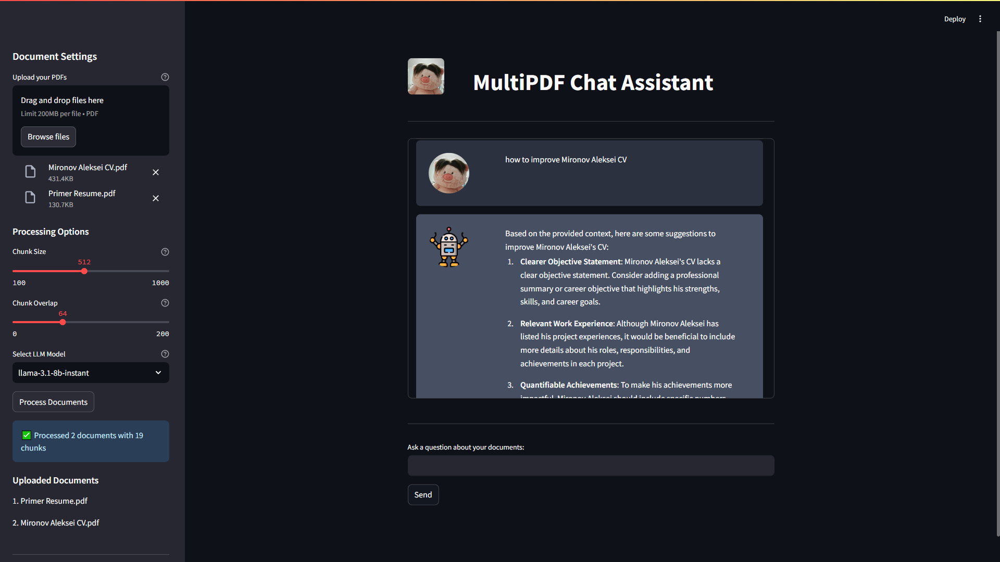
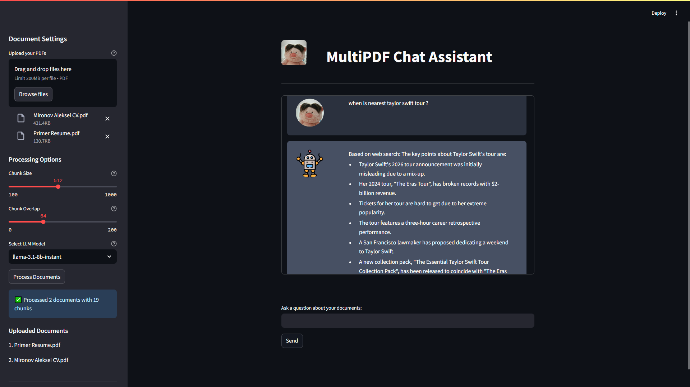
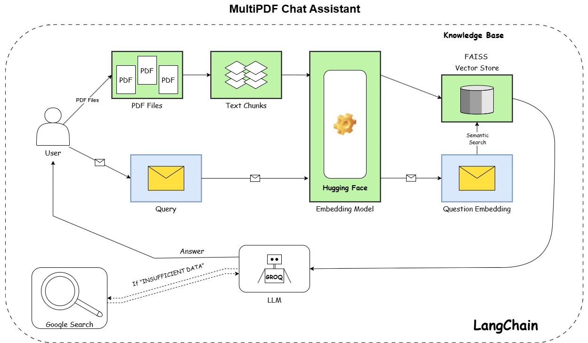

# MultiPDF Chat

A powerful conversational AI application that allows you to chat with the content of multiple PDF documents. Upload your PDFs and ask questions to get comprehensive answers, summaries, and insights from your documents.





##  Features

- **Document Intelligence:** Upload and analyze multiple PDF documents simultaneously
- **Advanced RAG Technology:** Semantic search with context-aware responses
- **Google Search Fallback:** Automatically searches the web when your documents don't have the answer
- **PDF Source Tracking:** Maintains document origins for accurate citations
- **Customizable Processing:** Adjust chunk sizes and overlap for optimal results
- **Multi-Model Support:** Choose from various Groq LLM models
- **Chat History:** Maintains conversation context for follow-up questions
- **Responsive UI:** Clean interface built with Streamlit

##  Table of Contents

- [Architecture](#architecture)
- [Technologies Used](#technologies-used)
- [Installation](#installation)
- [Usage](#usage)
- [How It Works](#how-it-works)
- [Project Structure](#project-structure)
- [Configuration](#configuration)
- [Future Improvements](#future-improvements)
- [License](#license)

##  Architecture

MultiPDF Chat uses Retrieval Augmented Generation (RAG) to provide accurate, contextually relevant responses to your questions about PDF documents:

1. **Document Processing:** Extracts and processes text from uploaded PDFs with source tracking
2. **Text Chunking:** Splits documents into manageable pieces with controllable overlap
3. **Embedding Generation:** Converts text chunks into vector embeddings
4. **Semantic Search:** Retrieves the most relevant document sections based on your query
5. **Context-Aware Response Generation:** Synthesizes information into natural responses with citations
6. **Web Search Fallback:** Searches the internet when your documents don't contain an answer



##  Technologies Used

- **[LangChain](https://www.langchain.com/)**: Framework for building context-aware applications with LLMs
- **[FAISS](https://github.com/facebookresearch/faiss)**: Efficient similarity search and vector store
- **[HuggingFace Embeddings](https://huggingface.co/)**: High-quality text embeddings (sentence-transformers/all-MiniLM-L6-v2)
- **[Streamlit](https://streamlit.io/)**: Interactive web application framework
- **[Groq](https://groq.com/)**: Fast LLM API provider
- **[PyPDF](https://pypi.org/project/pypdf/)**: PDF text extraction
- **[Google Serper API](https://serper.dev/):** Real-time web search capabilities


##  Installation

```bash
# Clone the repository
git clone https://github.com/Asura3301/multipdf_chat.git
cd multipdf_chat

# Create and activate a virtual environment (optional but recommended)
python -m venv .venv
source venv/bin/activate  # On Windows: venv\Scripts\activate

# Install dependencies
pip install -r requirements.txt

# Set up environment variables
echo "GROQ_API_KEY=your_groq_api_key" > .env
echo "SERPER_API_KEY=your_serper_api_key" >> .env
```

##  Usage

```bash
# Start the Streamlit app
streamlit run app.py
```

Then open your browser and navigate to `http://localhost:8501`

### Using the Application:

1. **Upload Documents**: Use the sidebar to upload your PDF files
2. **Configure Settings**: Adjust chunk size, overlap, and model parameters if needed
3. **Process Documents**: Click "Process Documents" to extract text and build the knowledge base
4. **Ask Questions**: Type your questions about the documents in the input field
5. **Review Answers:** Get AI-generated responses based on your PDFs or web search results

##  How It Works

1. **PDF Processing Pipeline:**
   - The application converts uploaded files into manageable (filename, bytes_content) tuples
   - Text is extracted from each page with document source tracking
   - Unique document identifiers are maintained for accurate citations

2. **Text Chunking:** The extracted text is divided into manageable chunks using LangChain's `RecursiveCharacterTextSplitter` with customizable size and overlap.

3. **Vector Embedding:** Each text chunk is converted into a vector embedding using HuggingFace's sentence transformer model.

4. **Vector Database:** The embeddings are stored in a FAISS vector store for efficient similarity search.

5. **Query Processing Flow:**
   - When you ask a question, it's processed through a conversation chain
   - If you reference previous messages, a history-aware retriever reformulates your query
   - The most relevant text chunks are retrieved based on semantic similarity
   - The LLM generates a comprehensive answer using retrieved context with few-shot examples:
     - Examples guide the model to provide concise answers with proper citations
     - If the answer is in the documents, it responds with the information and source
     - If information is missing, it responds with "INSUFFICIENT DATA"
   - If the answer cannot be found in your documents, the system automatically searches the web through Google Search

6. **Web Search Fallback:**
   - If the system determines your documents don't contain the answer, it triggers web search
   - The search query is optimized using the LLM
   - Results are formatted and fed back to the LLM for a comprehensive response
   - The answer is clearly marked as coming from web search rather than your documents

##  Project Structure

```
multipdf_chat/
├── app.py             # Main application file
├── config.py          # Configuration settings
├── html_templates.py  # HTML/CSS for the UI
├── google_search.py   # Web search fallback functionality
├── requirements.txt   # Project dependencies
└── README.md          # Documentation
```

##  Configuration

The Main configurations of the application are in `config.py` file:

- **Models:** Choose from different Groq LLMs with adjustable parameters(temperature and token limits)
- **Chunking:** Fine-tune text chunking size and overlap
- **UI:** Customize appearance and behavior
- **Embedding:** Configure embedding models
- **Retrieval:** Adjust semantic search parameters
- **Web Search:** Enable/disable Google Search fallback

##  Future Improvements

- [x] Implement web search fallback for unanswered questions
- [x] Add proper PDF preprocessing with source tracking
- [ ] Add Multimodal Input(not only PDFs, in multipdf project haha)
- [ ] Extract and utilize document metadata for enhanced filtering
- [ ] Implement more advanced citation mechanisms
- [ ] Add support for multiple languages
- [ ] Enable PDF table and image extraction
- [ ] Add question clustering for related follow-ups
- [ ] Implement document comparison capabilities

##  License

MIT License 


