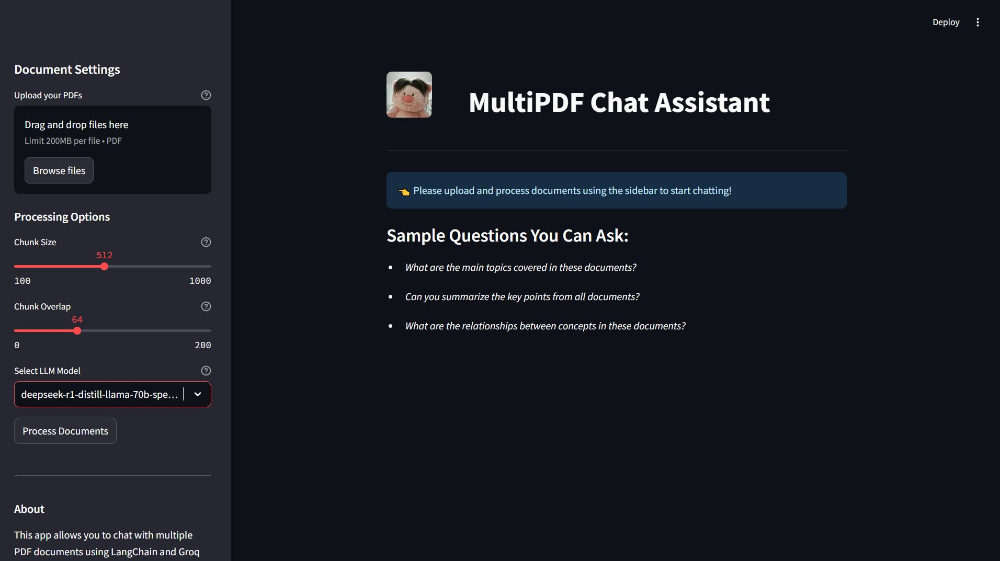

# MultiPDF Chat

A powerful conversational AI application that allows you to chat with the content of multiple PDF documents. Upload your PDFs and ask questions to get comprehensive answers, summaries, and insights from your documents.



##  Features

-  Upload and process multiple PDF documents
-  Natural language conversation with document content
-  Semantic search powered by FAISS vector store
-  Advanced context awareness with LangChain RAG technology
-  Dynamic text chunking with customizable parameters
-  Integration with Groq's powerful LLMs
-  Stateful conversation with chat history
-  Clean, responsive UI built with Streamlit

##  Table of Contents

- [Architecture](#architecture)
- [Technologies Used](#technologies-used)
- [Installation](#installation)
- [Usage](#usage)
- [How It Works](#how-it-works)
- [Project Structure](#project-structure)
- [Configuration](#configuration)
- [Future Improvements](#future-improvements)
- [License](#license)

##  Architecture

MultiPDF Chat uses Retrieval Augmented Generation (RAG) to provide accurate, contextually relevant responses to your questions about PDF documents:

1. **Document Processing**: Extracts and processes text from uploaded PDFs
2. **Text Chunking**: Splits documents into manageable pieces
3. **Embedding Generation**: Converts text chunks into vector embeddings
4. **Similarity Search**: Retrieves the most relevant document sections
5. **Context-Aware Response Generation**: Synthesizes information into natural responses

##  Technologies Used

- **[LangChain](https://www.langchain.com/)**: Framework for building context-aware applications with LLMs
- **[FAISS](https://github.com/facebookresearch/faiss)**: Efficient similarity search and vector store
- **[HuggingFace Embeddings](https://huggingface.co/)**: High-quality text embeddings (sentence-transformers/all-MiniLM-L6-v2)
- **[Streamlit](https://streamlit.io/)**: Interactive web application framework
- **[Groq](https://groq.com/)**: Fast LLM API provider
- **[PyPDF](https://pypi.org/project/pypdf/)**: PDF text extraction


##  Installation

```bash
# Clone the repository
git clone https://github.com/Asura3301/multipdf_chat.git
cd multipdf_chat

# Create and activate a virtual environment (optional but recommended)
python -m venv venv
source venv/bin/activate  # On Windows: venv\Scripts\activate

# Install dependencies
pip install -r requirements.txt

# Set up environment variables
echo "GROQ_API_KEY=your_groq_api_key" > .env
echo "HUGGINGFACE_API_TOKEN=your_hf_token" >> .env
```

##  Usage

```bash
# Start the Streamlit app
streamlit run app.py
```

Then open your browser and navigate to `http://localhost:8501`

### Using the Application:

1. **Upload Documents**: Use the sidebar to upload your PDF files
2. **Configure Settings**: Adjust chunk size, overlap, and model parameters if needed
3. **Process Documents**: Click "Process Documents" to extract text and build the knowledge base
4. **Ask Questions**: Type your questions about the documents in the input field
5. **Review Answers**: Get AI-generated responses based on the content of your PDFs

##  How It Works

1. **PDF Processing**: The application extracts text from each page of the uploaded PDFs.

2. **Text Chunking**: The extracted text is divided into manageable chunks using LangChain's `RecursiveCharacterTextSplitter`.

3. **Vector Embedding**: Each text chunk is converted into a vector embedding using HuggingFace's sentence transformer model.

4. **Vector Database**: The embeddings are stored in a FAISS vector store for efficient similarity search.

5. **Query Processing**:
   - When you ask a question, it's processed through a conversation chain
   - Your query is reformulated to be standalone if it references previous conversation
   - The most relevant text chunks are retrieved based on semantic similarity
   - The LLM generates a comprehensive answer using the retrieved context

##  Project Structure

```
multipdf_chat/
├── app.py             # Main application file
├── config.py          # Configuration settings
├── html_templates.py  # HTML/CSS for the UI
├── requirements.txt   # Project dependencies
└── README.md          # Documentation
```

##  Configuration

The application is highly configurable through the `config.py` file:

- **Models**: Change default models, temperature, and token limits
- **Chunking**: Adjust text chunking size and overlap
- **UI**: Modify application appearance and behavior
- **Embedding**: Configure embedding models and parameters
- **Retrieval**: Tune the semantic search parameters

##  Future Improvements

- [ ] Implement document metadata extraction and filtering
- [ ] Implement citation of sources in responses
- [ ] Add multiple language support

##  License

MIT License 


